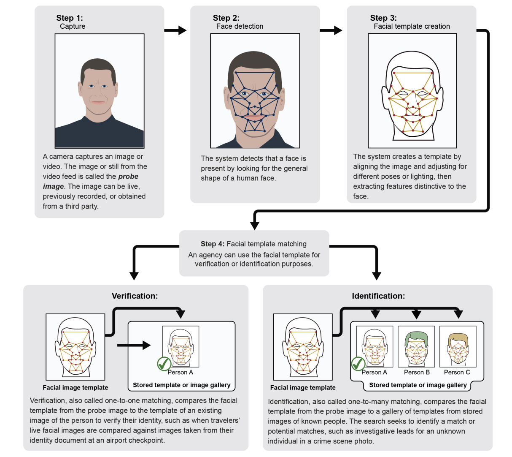
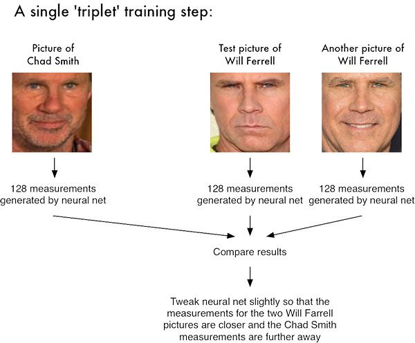

# Emotion Detection
### Overview
- This project focuses on detecting emotions, specifically happy and sad, using Machine Learning (ML). The system classifies text, speech, or facial expressions 
  into these two emotional states. Emotion detection is useful in areas like sentiment analysis, customer feedback, and mental health monitoring.

### Features
- Text Emotion Detection: Detects whether text expresses happiness or sadness.
- Speech Emotion Detection: Analyzes audio recordings to determine if the tone is happy or sad.
- Facial Expression Detection: Identifies happy or sad emotions from facial images or video frames.

### Technologies Used
- Python: Core language for development.
- TensorFlow / Keras: Used for building and training the machine learning models.
- Scikit-learn: For classical ML algorithms like SVM, Logistic Regression.
- OpenCV: For facial recognition and emotion analysis.
- NLTK / TextBlob: For text processing and emotion analysis from written content.
- Librosa: For processing audio signals in speech emotion detection.

## How It Works
  - Face Detection:
    

  

        The first step is to detect the face in an image or video. This is done using algorithms like:
        Haar Cascades (provided by OpenCV).
        Dlib’s facial landmark detector.
        MTCNN (Multi-task Cascaded Convolutional Networks), commonly used in deep learning.

### Facial Landmark Detection:

  

Once the face is detected, key points on the face (called landmarks) are identified. These landmarks include the eyes, nose, mouth, and jawline.
Algorithms like Dlib provide 68 landmarks that can be used to track expressions.

### Feature Extraction:

   From these landmarks, specific features such as eyebrow movements, eye openness, and mouth shape are extracted. These features change with different emotions.
   Techniques like histograms of oriented gradients (HOG) or deep learning-based feature extraction are commonly used.
   
### Emotion Classification:

The extracted facial features are then fed into a machine learning model or a deep learning network to classify the emotion.
Models like Convolutional Neural Networks (CNNs), Support Vector Machines (SVM), or Random Forests can be trained on labeled emotion datasets to predict emotions like happy, sad, angry, etc.
Emotion Prediction:

Based on the facial expressions and the model’s training, it outputs the predicted emotion 
### Happy, Sad, Angry, Neutral, et

  

## Install Dependencies pip :
     install -r requirements.txt
     install numpy pandas opencv-python tensorflow keras scikit-learn librosa NLTK TextBlob fer

 Thank you for your support and guidance in developing my emotion detection project. Your insights have been invaluable!🙂
    
 
